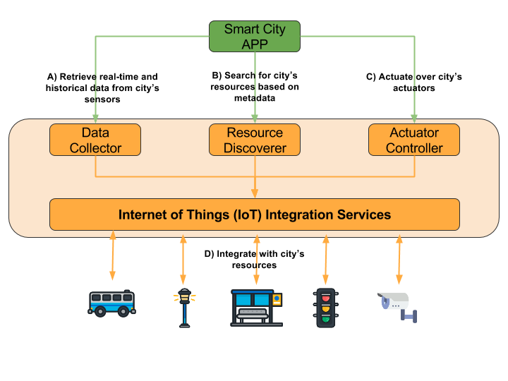

# Smart City Platform Architecture

This page presents an overview of the microservice architecture
provided by the Smart City Software Platform.

## Summary

* [Overview](#overview)
* [Microservices view](#microservices-view)
* [Deployment view](#deployment-view)
* [Design constraints and guidelines](#design-constraints-and-guidelines)
* [Security](#security)
* [Roadmap](#roadmap)
  * [API](#api)
  * [Service discovery](#service-discovery)
  * [Messaging](#messaging)
  * [API Gateway](#api-gateway)

## Overview

The project aims to provide high-level services to support 
novel applications that interact with city's resources such as bus,
street cameras, environmental sensors, and public open data. For this purpose,
it works as an integrated, scalable software infrastructure gathering
three key-enabling technologies: IoT, BigData and Cloud Computing. Such
infrastructure must support cross-domain applications rather than 
technological silos by sharing services, APIs, data, and standards.

There are two kind of services provided by the platform:

* Front-end services: native platform services with graphical interfaces.
Such services provide features to visualize data from city resources as well
as meta-data for administrative purpose.
* Development services: native platform services accessible through high-level
APIs to support Smart Cities application, new services, and other development
tools. While most services are based on REST protocol, we plan to add new
platform services supported by other protocols soon, such as Websocket.

The following diagram presents a summarized overview of the development 
services provided by the platform:

> Icons from [Flaticon](http://www.flaticon.com/packs/urban-3) and by 
[Madebyoliver](http://www.flaticon.com/authors/madebyoliver).

Data Collector, Resource Discoverer and Actuator Controller services can be
used by application developers to access city's resources, as denoted by
**A**, **B** and **C** labeled arrows. The integration of new physical 
resources may use the IoT Integration Services APIs. However, the communication
represented by the **D** arrow must only be used for integration of new 
resources to the platform, not for end-user application development.

Next section describes in more detail the platform's **microservices
architecture**, designed to provide the required features to support Smart
Cities.

## Microservices view

In order to properly provide an unified technological infrastructure to 
city-scale services, the platform
needs to integrate a large number of heterogeneous physical devices and 
services. Thus, the platform is based on a scalable, distributed 
**microservices** architecture.
To see the detailed relation of existing 
microservices, check the [Microservices
documentation page](../microservices/Microservices.md)

The following figure presents the platform's main services and how they
communicate:

> Icons from [Flaticon](http://www.flaticon.com/packs/urban-3)

Communication between services are represented as directed arrows labeled by
red circles:

* **(A) Physical devices integration:** City's resources
are coupled with cyber-physical devices, such as sensors and actuators, which
may integrate to the platform by serveral different protocols. Thus, the
*Resource Adaptor* is a gateway service to which devices can register at the
platform, send and request data. Every registered resource receives an 
[UUID](https://tools.ietf.org/html/rfc4122). Checkout the supported protocols
and technical details in the [Resource Adaptor page]().
* **(B) Resource register:** In order to make a resource available on the
platform, *Resource Adaptor* sends the resource meta-data to *Resource
Cataloguer* service through its REST API. These meta-data describes the main
features of a resource, exposing its capabilities, location and other important
information.
* **(C) Resource creation notification:** After registering a new resource,
the *Resource Cataloguer* notifies *Data Collector* service if the resource
has sensor capabilities. Similarly, the *Actuator Controller* service is 
notified whenever a new resource has actuator capabilities.
* **(D) Sending actuation requests to resources**: The *Actuator Controller*
services is responsible to intermediate and register the actuation requests
to city's resources. To send those requests, the *Actuator Controller*
uses the REST API provided by the *Resource Adaptor*.
* **(E) Collecting data from resources**: The *Data Collector*
services is responsible to pooling *Resource Adaptor* services gathering new
data from resources with sensor capabilities. *This architecture is not 
suitable for various sensors and must be redesigned soon so that it can go
asynchronous, event-based and more scalable*.
* **(F) Search for resources based on context data:** The 
*Resource Discoverer* service provides a high-level API for Smart City 
applications to query registered city's resources by context data. Currently,
*Resource Discoverer* request the *Resource Cataloguer* for resource's 
location and meta-data. It also uses the *Data Collector* to filter available
resources based on sensors' data parameters.
* **(G) Request for resources' details:** The *Resource Viewer* is a 
visualization service that presents an overview of all city's resources. It 
provides a Web front-end page which may be used both for real-time data 
visualization and check resources administrative meta-data. *Resource Viewer*
uses the *Resource Cataloguer* REST API to get the available resources and
their meta-data. It also uses the *Data Collector* REST API to get the last
data from specific resources with sensor capabilities.

## Deployment view

> Comming soon

## Design constraints and guidelines

> Comming soon

## Security

> Comming soon

## Roadmap

### API

The following features must be covered in future implementations:

* Automatic documentation based on code
  * [API Blueprint](https://apiblueprint.org/)
  * [Apidoc](https://github.com/mbryzek/apidoc)
  * [RAML](http://raml.org/)
  * [Swagger](http://swagger.io/)
* Pagination
* Versioning
* Support query language with [GraphQL](http://graphql.org/)
* Support linked objects to resource composition with 
[JSON-LD](http://json-ld.org/)

### Service discovery

Currently, the link between platform's services is configured through 
statically config files. However, we plan to integrate a service discovery
system to support dynamic service discovery. These are some options:

* [Eureka by Netflix](https://github.com/Netflix/eureka)
* [ETCD by CoreOS](https://github.com/coreos/etcd)
* [SmartStack by Airbnb](http://nerds.airbnb.com/smartstack-service-discovery-cloud/)
* [NSQ](http://nsq.io/)
* [SERF by HashiCorp](https://www.serf.io/)
* [SkyDNS](https://github.com/skynetservices/skydns)

### Messaging

Some of the synchronous communication between services may be redesigned to be
support asynchronous messaging. These are some open source options:

* [Mist](https://github.com/nanopack/mist)
* [Apache Kafka](http://kafka.apache.org/)
* [RabbitMQ](https://www.rabbitmq.com/)
* [Mosquitto by Eclipse](https://mosquitto.org/)

### API Gateway

The [API Gateway design pattern](http://microservices.io/patterns/apigateway.html) 
has not been adopted yet. There are some open source options:

* [Kong](https://getkong.org/)
* [Skipper](https://github.com/zalando/skipper)
* [Traefik](http://traefik.io/)
* [Tyk](https://tyk.io/)
* [Zuul by Netflix](https://github.com/Netflix/zuul)
