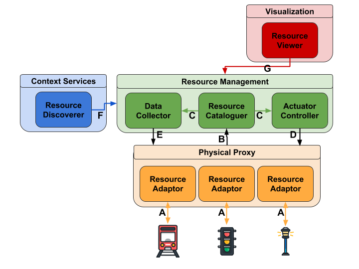

# Smart City Platform Architecture

This page presents an overview of the microservice architecture
provided by the Smart City Software Platform.

## Summary

* [Overview](#overview)
* [Design constraints and guidelines](#design-constraints-and-guidelines)
* [Security](#security)
* [Roadmap](#roadmap)

## Overview

The project aims to provide high-level services to support 
novel applications that interact with city's resources such as bus,
street cameras, environmental sensors, and public open data. 
In order to properly provide such services to city-scale, the platform
needs to integrate a large number of heterogeneous physical devices and 
services. Thus, the platform is based on a scalable, distributed 
**microservices** architecture.

The following figure presents the platform's main services and how they
communicate:

## Design constraints and guidelines

## Security

## Roadmap
