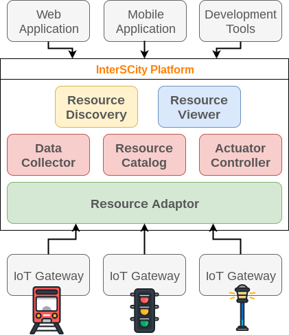

# InterSCity Platform Architecture

This page presents an overview of the microservice architecture
provided by the InterSCity Platform.

## Summary

* [Overview](#overview)
* [Microservices view](#microservices-view)
* [Deployment view](#deployment-view)
* [Design constraints and guidelines](#design-constraints-and-guidelines)
* [Security](#security)
* [Roadmap](#roadmap)
  * [API](#api)
  * [Service discovery](#service-discovery)
  * [Messaging](#messaging)
  * [API Gateway](#api-gateway)

## Overview

The project aims at providing high-level services to support 
novel applications that interact with city's resources such as bus,
street cameras, environmental sensors, and public open data. For this purpose,
it works as an integrated, scalable software infrastructure gathering
three key-enabling technologies: IoT, BigData and Cloud Computing. Such
infrastructure must support cross-domain applications rather than 
technological silos by sharing services, APIs, data, and standards.

The following diagram presents a summarized overview of the development 
services provided by the platform:

> Icons from [Flaticon](http://www.flaticon.com/packs/urban-3) and by 
[Madebyoliver](http://www.flaticon.com/authors/madebyoliver).

The Platform provides high-level RESTful services to support the development of
smart city applications, services and tools for different purposes and domains.
Currently, it is composed of **six** different microservices that provide
features for the integration of IoT devices ( Resource Adaptor ), data
and resource management ( Resource Catalog , Data Collector and Actuator
Controller ), resource discovery through context data ( Resource Discovery )
and visualization ( Resource Viewer )

The platform intermediates all communication between smart city applications
and IoT devices, as well as the complexity of city-scale data management.
Specific IoT Gateways register city resources and post
their sensorized data to the platform through the Resource Adaptor API. IoT
Gateways may also subscribe to receive notifications to act over undelying
actuator devices

Next section describes in more detail the platform's **microservices
architecture**, designed to provide the required features to support Smart
Cities.

## Microservices view

In order to properly provide an unified technological infrastructure to
city-scale services, the platform
needs to integrate a large number of heterogeneous physical devices and
services. Thus, the platform is based on a scalable, distributed
**microservices** architecture.
To see the detailed relation of existing
microservices, check the [Microservices
documentation page](../microservices/Microservices.md)

Microservices can communicate through their RESTful APIs or asynchronously 
through [RabbitMQ message bus](https://www.rabbitmq.com/) with the
[publish-subscribe design pattern](https://en.wikipedia.org/wiki/Publish%E2%80%93subscribe_pattern).
In particular, we vastly use the topic-based communication through RabbitMQ
as explained [in this tutorial](https://www.rabbitmq.com/tutorials/tutorial-five-ruby.html)
To demonstrate how the microservices communicate with each other,
we present below the main scenarios of platform usage that trigger the
execution of more than one platform service. In all diagrams, blue arrows
represent asynchronous communication through AMQP, while red arrows represent
HTTP-based communication through REST APIs.

###  Microservices communication on resource creation

1. **Physical devices integration:** City's resources
are coupled with cyber-physical devices, such as sensors and actuators, which
may integrate to the platform by serveral different protocols. Thus, the
*Resource Adaptor* is an unified endpoint service to which devices can register at the
platform, send and request data. Every registered resource receives an 
[UUID](https://tools.ietf.org/html/rfc4122). Checkout the supported protocols
and technical details in the [Resource Adaptor page](../microservices/resource-adaptor.md).
1. **Resource register:** In order to make a resource available on the
platform, *Resource Adaptor* sends the resource meta-data to *Resource
Cataloguer* service through its REST API. These meta-data describes the main
features of a resource, exposing its capabilities, location and other important
information.
1. **Resource creation notification:** After registering a new resource,
the *Resource Cataloguer* publish an event to the
[RabbitMQ message bus](https://www.rabbitmq.com/) which may notify the 
*Data Collector* service if the resource has sensor capabilities. Similarly,
the *Actuator Controller* service is notified whenever a new resource has
actuator capabilities.

### Microservices communication on data stream

1. **Collecting data from resources**: An IoT Gateway post new sensor data to
the platform through the *Resource Adaptor* REST API. Then,
the *Resource Adaptor* publishes a new event to RabbitMQ in the data\_stream
topic.
1. **Data stream notification**: Microservices interested in the most recent
data provided by resources must subscribe to receive notifications.
Currently, the *Data Collector* service stores all observed data in a
historical database for futher processing. In a near future, we intented to:
  * Implement the location update on *Resource Catalog*
  * Implement a Big Data architecture for real time processing

### [Not Implemented] Microservices communication on resource actuation

The actuation support is not working currently. We intend to support it
in a near future, as described in
[this issue](https://gitlab.com/smart-city-software-platform/resource-adaptor/issues/2)
This architecture will probably work on MQTT or as a Web Hook.

1. An IoT Gateway subscribes to receive actuation commands for a specific
resource (identified by its UUID).
2. The *Resource Adaptor* forwards the subscription to the message broker
RabbitMQ in *actuation* topic
3. An external application may send commands to chage city resources state
through actuation capabilities. Thus, it sends an actuation request to 
*Actuator Controller* REST API
4. The *Actuator Controller* publishes the request on RabbitMQ with *actuation*
topic
5. RabbitMQ notifies the *Resource Adaptor* with the command
6. The *Resource Adaptor* fowards the notification to the IoT Gateway

### Microservices communication on Resource Discovery and Visualization

1. In order to discovery registered resources available on the city,
client applications may query the *Resource Discovery* high-level API
based on context-data, such as current status and location
2. Platform Administrator users may use the *Resource Viewer* application
to visualize the existing resources in the city

Both *Resource Discovery* and *Resource Viewer* request the *Resource Catalog*
API to get static data about resources (3). They also request historical and
real-time data to *Data Collector* microservice (4).

TODO: CONTINUE HERE

## Deployment view

> Comming soon

## Design constraints and guidelines

> Comming soon

## Security

> Comming soon

## Roadmap

### API

The following features must be covered in future implementations:

* Automatic documentation based on code
  * [API Blueprint](https://apiblueprint.org/)
  * [Apidoc](https://github.com/mbryzek/apidoc)
  * [RAML](http://raml.org/)
  * [Swagger](http://swagger.io/)
* Pagination
* Versioning
* Support query language with [GraphQL](http://graphql.org/)
* Support linked objects to resource composition with 
[JSON-LD](http://json-ld.org/)

### Service discovery

Currently, the link between platform's services is configured through 
statically config files. However, we plan to integrate a service discovery
system to support dynamic service discovery. These are some options:

* [Eureka by Netflix](https://github.com/Netflix/eureka)
* [ETCD by CoreOS](https://github.com/coreos/etcd)
* [SmartStack by Airbnb](http://nerds.airbnb.com/smartstack-service-discovery-cloud/)
* [NSQ](http://nsq.io/)
* [SERF by HashiCorp](https://www.serf.io/)
* [SkyDNS](https://github.com/skynetservices/skydns)

### Messaging

Some of the synchronous communication between services may be redesigned to be
support asynchronous messaging. These are some open source options:

* [Mist](https://github.com/nanopack/mist)
* [Apache Kafka](http://kafka.apache.org/)
* [RabbitMQ](https://www.rabbitmq.com/)
* [Mosquitto by Eclipse](https://mosquitto.org/)

### API Gateway

The [API Gateway design pattern](http://microservices.io/patterns/apigateway.html) 
has not been adopted yet. There are some open source options:

* [Kong](https://getkong.org/)
* [Skipper](https://github.com/zalando/skipper)
* [Traefik](http://traefik.io/)
* [Tyk](https://tyk.io/)
* [Zuul by Netflix](https://github.com/Netflix/zuul)
